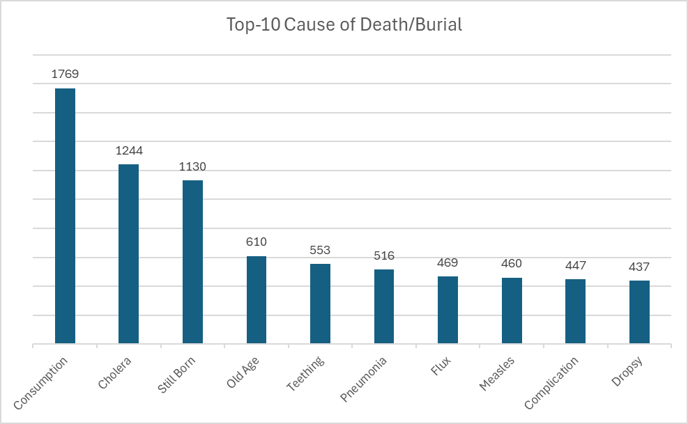
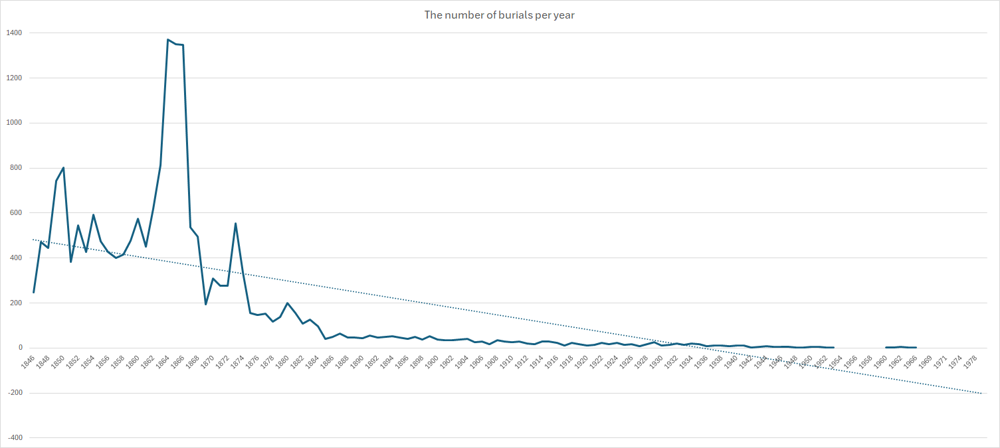
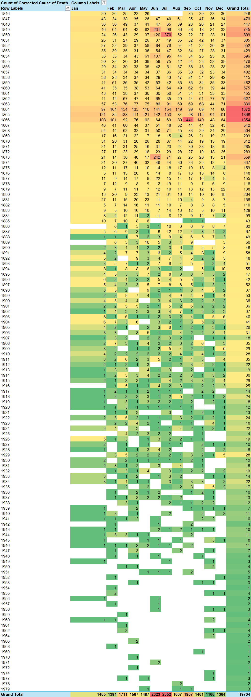
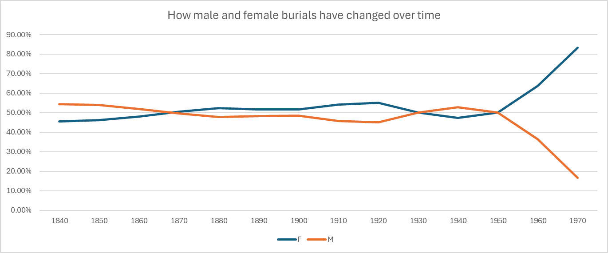
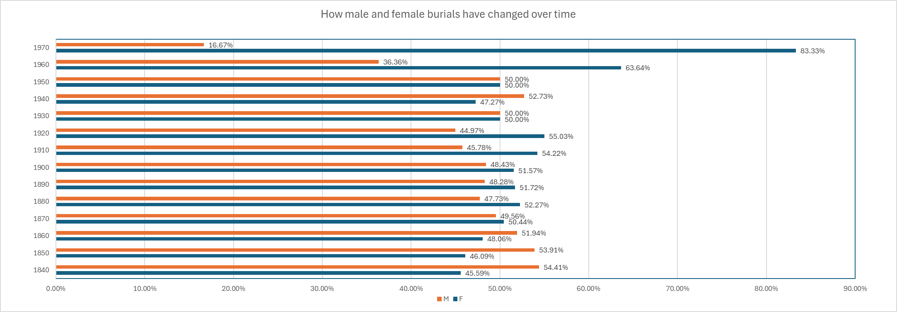
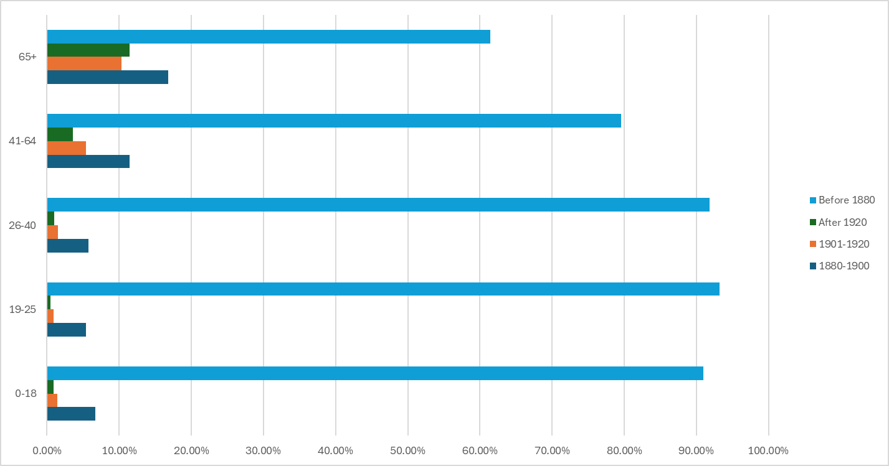
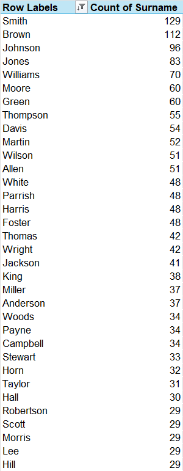
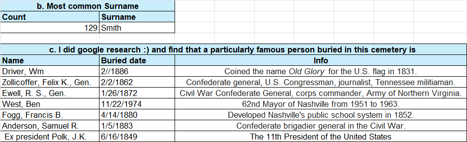
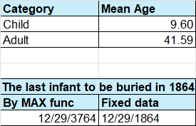

### **Nashville City Cemetery Analysis**  

### **Project Overview**  
This project analyzes historical burial records from the **Nashville City Cemetery** dataset, covering burials from **1846 to 1979**. The dataset, provided by the city of Nashville, offers insights into historical trends in **medicine, mortality rates, literacy, and social inequalities**.  
The **Nashville City Cemetery Association** requested an analysis of the dataset to compare its burial records with those from other historic cemeteries in the U.S. The data, originating from handwritten records, contains inconsistencies and typographical errors, requiring data cleaning and correction.  

Additionally, a **marketing brochure** titled **Nashville_City_Cemetery_Brochure** was created to highlight the **top 7 most famous individuals buried in the cemetery**, making historical insights more engaging for the public.  

### **Dataset**  
The dataset consists of multiple sheets:  
- **Question_1** – Results of calculations and insights for Question 1  
- **Question_2** – Results of calculations and insights for Question 2  
- **Question_3** – Results of calculations and insights for Question 3  
- **Question_4** – Results of calculations and insights for Question 4  
- **Question_5** – Results of calculations and insights for Question 5  
- **Question_6** – Results of calculations and insights for Question 6  
- **Burials_1864** – Modified data for Question 7  
- **Burials_1864_FILTER** – Filtered burial records for 1864 (Question 7)  
- **Historic_Nashville_City_Cemetery** – Raw data containing original burial records  

---

## **Analysis and Findings**  

### **1. Top 10 Causes of Death**  
- A **pivot table** was used to identify the **10 most common causes of death**.  
- Spelling errors were corrected in a new column **("Corrected Cause of Death")** to improve data accuracy.  
- A **clustered column pivot chart** visualizes the results.  

---

### **2. Burials Per Year**  
- A **pivot table** was created to count burials per year.  
- A **line chart** with a **trend line** was used to analyze patterns over time.  
- **Conditional formatting** was applied to highlight the **top 10 years with the most burials**.  

---

### **3. Seasonal Burials (Month-Year Analysis)**  
- A **pivot table** was created to analyze burials per **year and month**.  
- **Conditional formatting** was applied to reveal patterns.  
- Further investigation was conducted on **unusual spikes** in certain months.  

---

### **4. Burials by Decade & Gender Distribution**  
- A **pivot table** categorized burials by **decade and gender**.  
- **Percentage calculations** were applied.  
- A **clustered bar chart** was created to show gender distribution over time.  

---

### **5. Age at Death Trends Over Time**  
- A **VLOOKUP table** was used to classify age groups:  
  - **0-18**, **19-25**, **26-40**, **41-64**, **65+**  
- Another column categorized burials into **historical time periods**:  
  - **Before 1880**, **1880-1900**, **1901-1920**, **After 1920**  
- A **grouped bar chart** visualizes age distribution changes over time.  

---

### **6. Most Common Last Names & Famous Burials**  
- A **new column ("Surname")** was created by extracting last names from full names.  
- A **pivot table** identified the **most common surnames** in the dataset.  
- Historical research was conducted to find **notable figures buried in the cemetery**.  

---

### **7. Civil War Burials (1864 Focus)**  
- A **FILTER function** was used to extract burials from **1864**.  
- Burials were categorized into: **Infants, Children, Adults**.  
- **Mean age** was calculated for **children and adults**.  
- A **burial date column** was generated using the **DATE() function**.  
- The last infant buried in 1864 was identified using **MAXIFS and FILTER** functions.  

---

## Marketing Component – Nashville City Cemetery Brochure  
To enhance public engagement, a **brochure** was created, highlighting **seven famous individuals buried in the cemetery**. This serves as an educational and promotional tool for the cemetery association.  

**Image to insert: Nashville_City_Cemetery_Brochure Cover Page & Sample Sections**  

---

## Conclusion  
This project provides a comprehensive analysis of burial records in **Nashville City Cemetery**, revealing historical patterns in mortality, demographics, and key societal events. The findings contribute to broader historical comparisons and also serve as a valuable resource for public engagement through the **marketing brochure**.  

