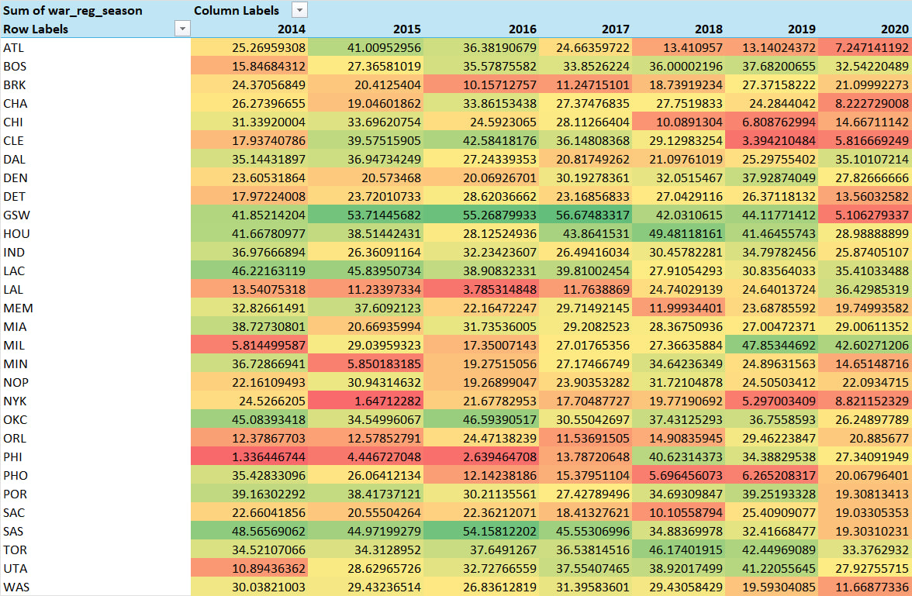

# **NBA Player Performance Analysis (2014-2020)**  

## **Project Overview**  
This project analyzes NBA player performance data from **2014 to 2020** using the dataset provided by **fivethirtyeight.com**. The data includes **offensive, defensive, and overall performance metrics**, comparing the **regular season (RS)** and **playoffs (PO)**.  
The goal of this analysis is to answer **key statistical questions** about player performance, team trends, and individual achievements using **Excel formulas, pivot tables, and data visualizations**.  

### **Dataset**  
The dataset consists of multiple sheets:  
- **basketball_stats** – Raw data of NBA player statistics from 2014-2020  
- **answers** – Final answers to analysis questions  
- **2016 war_playoffs** – Filtered 2016 playoff statistics for quartile analysis  
- **RS 2020** – Filtered 2020 regular season player statistics  
- **data_dictionary** – Explanation of dataset columns and metrics  

---

## **Analysis and Findings**  

### **1. Descriptive Statistics for Key Metrics**  
- **Mean, median, minimum, and maximum values** were calculated for:  
  - **predator_offense**, **predator_defense**, **predator_total**, and **pace_impact**  
- **Excel formulas** such as `AVERAGE`, `MEDIAN`, `MIN`, and `MAX` were used.  

---

### **2. Top Players in Offense & Defense**  
- The player with the **highest predator_offense** and **highest predator_defense** was identified using `XLOOKUP`.  
- Additional details retrieved include **season, season type, and team**.  

---

### **3. Total WAR for Atlanta Hawks (ATL)**  
- The total **Wins Above Replacement (WAR)** for **Atlanta Hawks players** was calculated using `SUM` and `FILTER`.  

---

### **4. Quartile Analysis of Playoff WAR in 2016**  
- The **first, second, and third quartiles** of `war_playoffs` for **2016 playoffs** were calculated using `QUARTILE.EXC`.  
- Players in the **top 25% of war_playoffs** in 2016 were identified using `FILTER`.  

---

### **5. Comparing the Top 5 NBA Players in 2020**  
The **top five players of 2020** (James Harden, LeBron James, Giannis Antetokounmpo, Kawhi Leonard, and Rudy Gobert) were analyzed using:  
- `VLOOKUP` to extract **raptor_offense**, **raptor_defense**, and **war_reg_season**.  
- Player comparisons were made to determine:  
  - **Best offensive player**  
  - **Best defensive player**  
  - **Most valuable player in the regular season**  

---

### **6. Team Trends in WAR Over Time**  
- A **pivot table** was created to track each team's **total war_reg_season** across years.  
- Three teams with **positive WAR trends** and three with **negative WAR trends** were identified using visual analysis.  
- A **drop-down selection tool** allows users to choose a team and view its performance over time.  

 

---

## **Conclusion**  
This analysis provides a **comprehensive view of player performance and team trends in the NBA from 2014-2020**. Key insights include:  
✅ Identifying **top offensive and defensive players** per season.  
✅ Recognizing **Atlanta Hawks’ total WAR contributions**.  
✅ Highlighting **elite performers in the 2016 playoffs**.  
✅ Comparing **2020’s top 5 players** based on multiple performance metrics.  
✅ Observing **team WAR trends over multiple seasons**.  

This project demonstrates **effective use of Excel formulas, pivot tables, and data visualization** to analyze and interpret NBA player performance data. 🚀