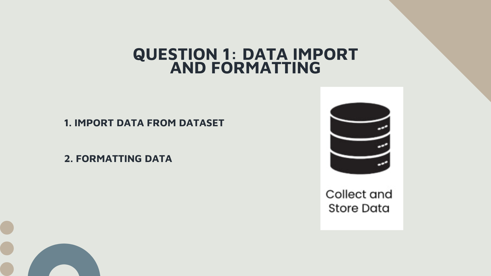
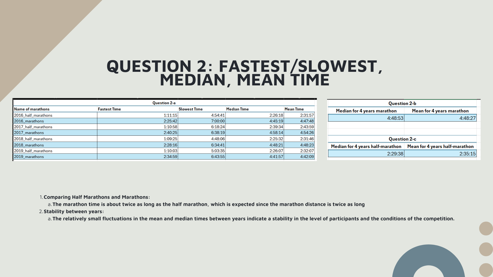
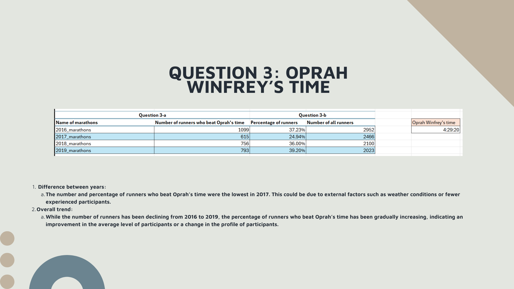
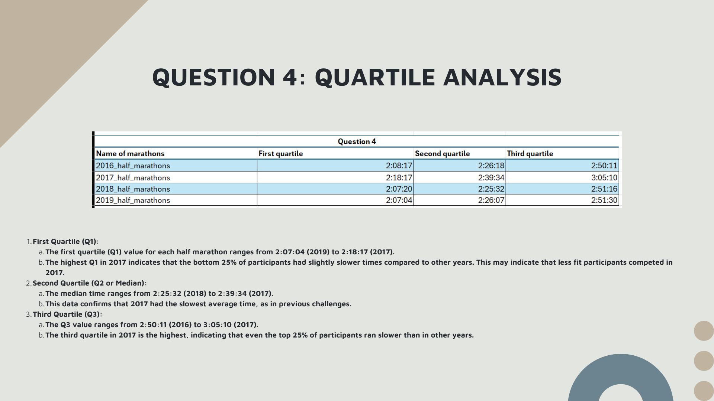
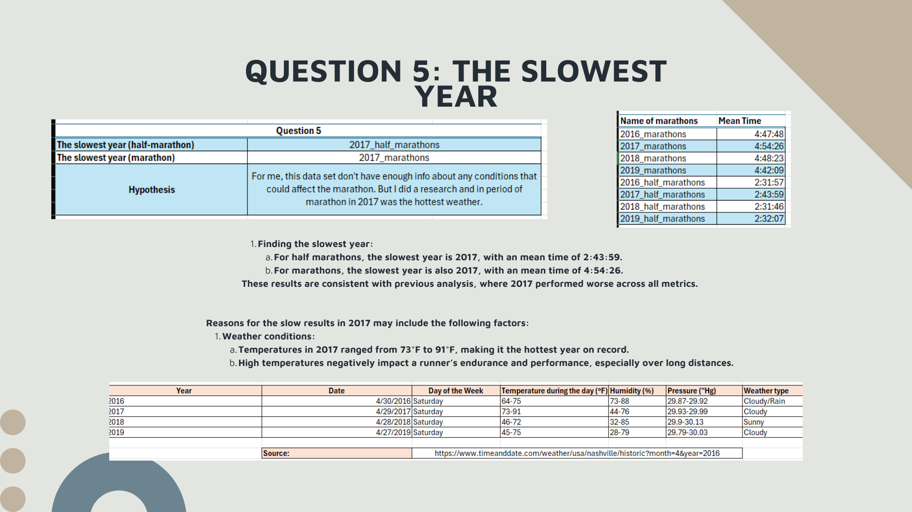
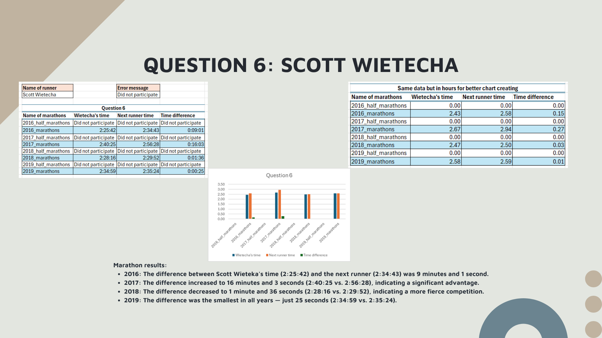
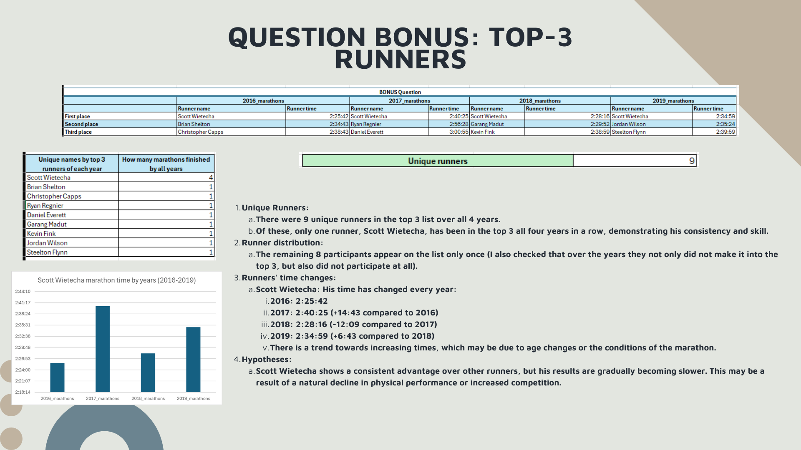

## Nashville Rock-and-Roll Marathon and Half-Marathon Race Results (2016 - 2019)  

### Overview  
This project analyzes race results from the Nashville Rock-and-Roll Marathon and Half-Marathon from 2016 to 2019 using Microsoft Excel. The dataset was imported from an MS Access database (`marathons.accdb`), and various calculations were performed to extract insights about runners' performances.  

## Dataset  
The dataset consists of multiple sheets:  
- **Question** – Question
- **Dictionary** – Dictionary
- **Analysis** – Results of calculations and insights  
- **2016_half_marathons** – Raw data about 2016 half marathons
- **2016_marathons** – Raw data about 2016 marathons
- **2017_half_marathons** – Raw data about 2017 half marathons
- **2017_marathons** – Raw data about 2017 marathons
- **2018_half_marathons** – Raw data about 2018 half marathons
- **2018_marathons** – Raw data about 2018 marathons
- **2019_half_marathons** – Raw data about 2019 half marathons
- **2019_marathons** – Raw data about 2019 marathons

---

### Data Preparation  
- Imported 8 tables (4 marathon and 4 half-marathon race results) from the Access database into separate worksheets.  
- Renamed the worksheets for clarity.  
- Formatted the `Time` column to display values in `HH:MM:SS` format.  
- Created an `analysis` worksheet to perform all calculations and visualizations.  

### Analysis Performed  
1. **Race Time Statistics**  
   - Calculated the fastest, slowest, median, and mean finish times for each race.  
   - Determined the overall median and mean marathon and half-marathon finish times across all four years.  

2. **Comparing Runners to Oprah’s Marathon Time**  
   - Counted how many runners each year finished faster than Oprah Winfrey’s marathon time (04:29:20).  
   - Calculated the percentage of runners who beat Oprah’s time.  

3. **Quartile Analysis for Half-Marathons**  
   - Identified the 1st, 2nd (median), and 3rd quartile finish times for each half-marathon.  

4. **Performance Trends Over the Years**  
   - Determined whether any year had significantly faster or slower finish times.  
   - Researched external factors, such as weather conditions, to explain potential differences.  

5. **Scott Wietecha’s Performance**  
   - Compared Scott Wietecha’s winning times with the next fastest runner each year.  

6. **Top Marathon Finishers (Bonus Analysis)**  
   - Identified the top three marathon runners for each year.  
   - Removed duplicate names across years to determine the number of unique top finishers.  
   - Counted how many times each top runner finished in the top three.  
   - Analyzed time variations for each top runner across multiple years.  

### Functions Used  
During the analysis, several built-in Excel functions were used, including:  
- **MIN, MAX, MEDIAN, AVERAGE** – To find race time statistics.  
- **COUNTIF, SUM, INDEX, MATCH** – To analyze Oprah’s time comparisons and ranking calculations.  
- **QUARTILE.EXC** – To determine quartiles for half-marathon finish times.  
- **FILTER, SMALL, UNIQUE, VSTACK, ROWS** – For advanced ranking and runner performance tracking.  

Each of these formulas is structured to work dynamically, meaning they can be shifted to analyze different datasets or time periods without modification.  

### Findings Presentation  
A brief presentation was created to summarize the key findings of this analysis. 

